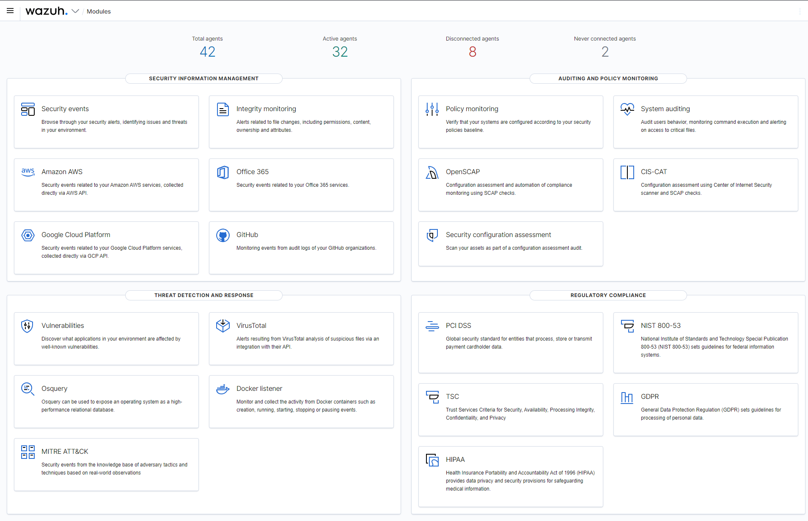
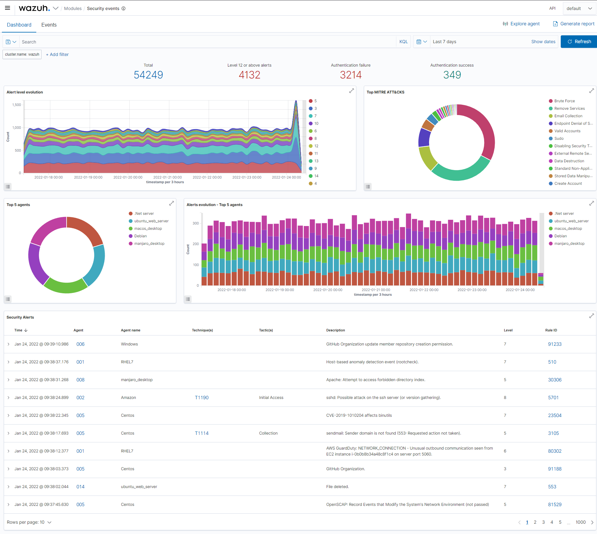
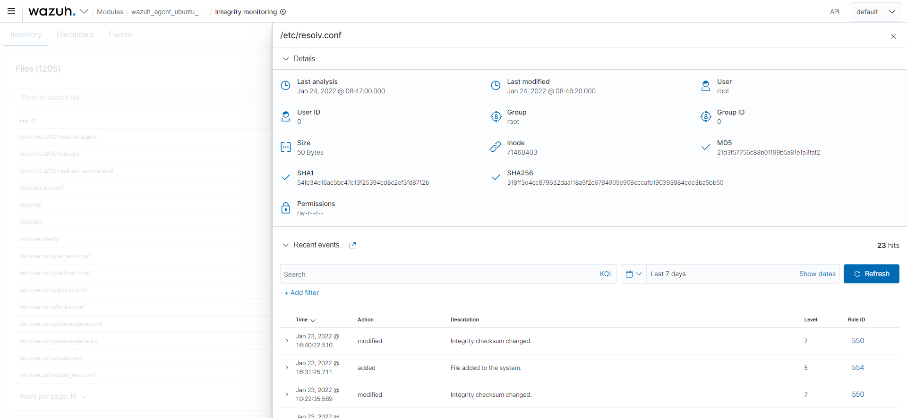
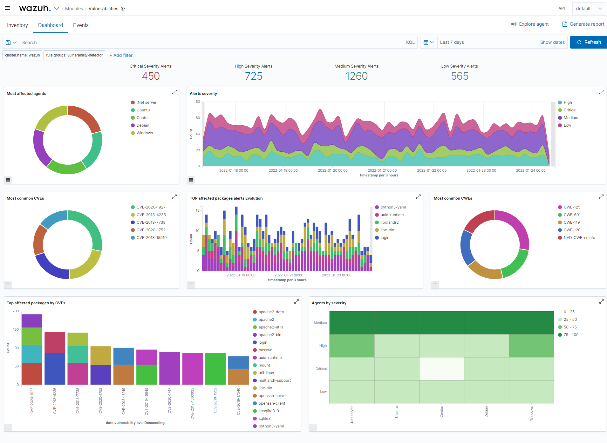
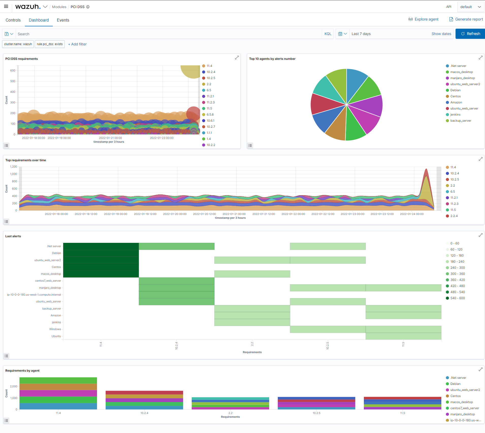
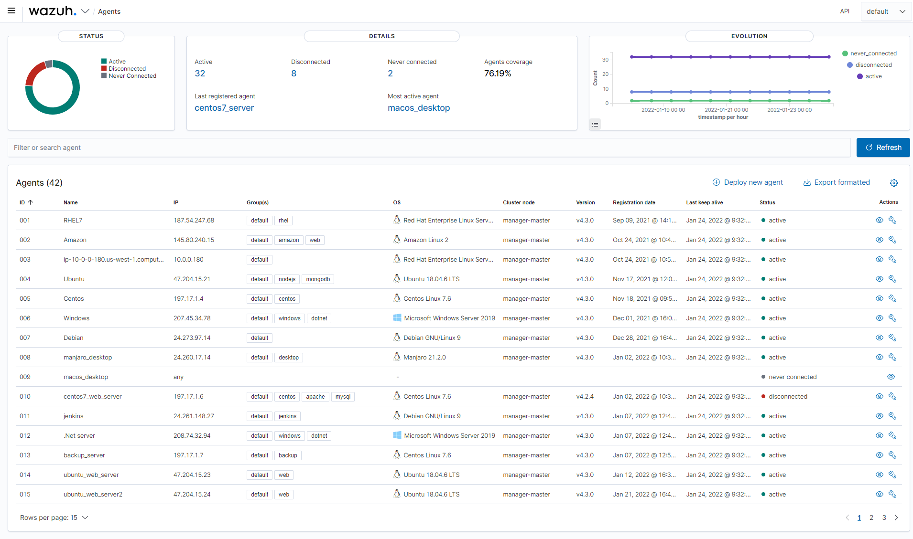
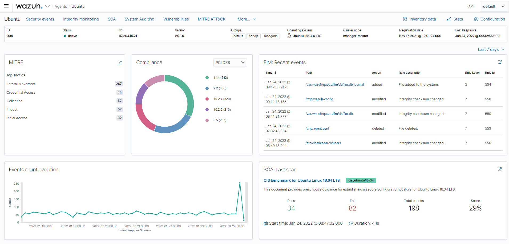

# Wazuh Kibana App

[](https://wazuh.com/community/join-us-on-slack/)
[](https://groups.google.com/forum/#!forum/wazuh)
[](https://documentation.wazuh.com)
[](https://wazuh.com)

This repository contains the Wazuh Kibana plugin, from which you can navigate through the Wazuh data using visualizations in a simple and understandable way. It also allows you to manage the configuration and capabilities of the Wazuh server.

Wazuh is a security detection, visibility, and compliance open source project. Wazuh helps you to gain deeper security visibility into your infrastructure by monitoring hosts at an operating system and application level.

You can learn more about it here [wazuh.com](https://wazuh.com/)

## Description

This plugin for Kibana allows you to visualize and analyze Wazuh alerts stored in Elasticsearch and provides the following capabilities:

- Search alerts classified by modules and filter them using the different views. You will be able to explore the alerts both at Wazuh cluster level, and in a particular agent. The modules, divided into the following use cases, are:
    - Security Information Management
        - Security events: Browse through your security alerts, identifying issues and threats in your environment.
        - Integrity monitoring: Alerts related to file changes, including permissions, content, ownership and attributes.
        - Amazon AWS: Security events related to your Amazon AWS services, collected directly via AWS API.
        - Office 365: Security events related to your Office 365 services.
        - GitHub: Security events related to your GitHub organizations, collected via GitHub audit logs API.
        - Google Cloud Platform: Security events related to your Google Cloud Platform services, collected directly via GCP API.
    - Auditing and Policy Monitoring
        - Policy monitoring: Verify that your systems are configured according to your security policies baseline.
        - Security configuration assessment: Scan your assets as part of a configuration assessment audit.
        - System auditing: Audit users behavior, monitoring command execution and alerting on access to critical files.
        - OpenSCAP: Configuration assessment and automation of compliance monitoring using SCAP checks.
        - CIS-CAT: Configuration assessment using Center of Internet Security scanner and SCAP checks.
    - Threat Detection and Response
        - Vulnerabilities: Discover what applications in your environment are affected by well-known vulnerabilities.
        - MITRE ATT&CK: Security events from the knowledge base of adversary tactics and techniques based on real-world observations.
        - VirusTotal: Alerts resulting from VirusTotal analysis of suspicious files via an integration with their API.
        - Osquery: Osquery can be used to expose an operating system as a high-performance relational database.
        - Docker listener: Monitor and collect the activity from Docker containers such as creation, running, starting, stopping or pausing events.
    - Regulatory Compliance
        - PCI DSS: Global security standard for entities that process, store or transmit payment cardholder data.
        - NIST 800-53: National Institute of Standards and Technology Special Publication 800-53 (NIST 800-53) sets guidelines for federal information systems.
        - GDPR: General Data Protection Regulation (GDPR) sets guidelines for processing of personal data.
        - HIPAA: Health Insurance Portability and Accountability Act of 1996 (HIPAA) provides data privacy and security provisions for safeguarding medical information.
        - TSC: Trust Services Criteria for Security, Availability, Processing Integrity, Confidentiality, and Privacy.
- View and edit the Wazuh manager configuration.
- Manage your ruleset (rules, decoders and CDB lists).
- Manage your groups of agents.
- Check the status and logs of your Wazuh cluster.
- Manage your agents, as well as see their configuration and data inventory. You can also deploy new agents.
- Explore and interact with the Wazuh API through our Dev Tools.

## Documentation

- [Full documentation](https://documentation.wazuh.com)
- [Wazuh installation guide](https://documentation.wazuh.com/current/installation-guide/index.html)
- [Screenshots](https://documentation.wazuh.com/current/index.html#example-screenshots)

**Modules overview**



**Security events**



**Integrity monitoring**



**Vulnerability detection**



**Regulatory compliance**



**Agents overview**



**Agent summary**



## Branches

- `stable` corresponds to the latest Wazuh app stable version.
- `master` branch contains the latest code, be aware of possible bugs on this branch.

## Requisites

- Wazuh HIDS 4.3.7
- Kibana 7.10.2
- Elasticsearch 7.10.2

## Installation

Ensure that the directory `/usr/share/kibana/data` exists
If not create it:

```
mkdir /usr/share/kibana/data
chown -R kibana:kibana /usr/share/kibana/data
```

Install the Wazuh app plugin for Kibana

```
cd /usr/share/kibana
sudo -u kibana bin/kibana-plugin install https://packages.wazuh.com/4.x/ui/kibana/wazuh_kibana-4.3.7_7.10.2-1.zip
```

Restart Kibana

- Systemd:

```
systemctl restart kibana
```

- SysV Init:

```
service kibana restart
```

## Upgrade

Note: Since Wazuh 4.0.4 release revision 4016 (regardless of the Elastic Stack version) the location of the wazuh.yml has been moved from `/usr/share/kibana/optimize/wazuh/config/wazuh.yml` to `/usr/share/kibana/data/wazuh/config/wazuh.yml`.

Since Wazuh 3.12.0 release (regardless of the Elastic Stack version) the location of the wazuh.yml has been moved from `/usr/share/kibana/plugins/wazuh/wazuh.yml` to `/usr/share/kibana/data/wazuh/config/wazuh.yml`.

Stop Kibana

- Systemd:

```
systemctl stop kibana
```

- SysV Init:

```
service kibana stop
```
Ensure that the directory `/usr/share/kibana/data` exists
If not create it:

```
mkdir /usr/share/kibana/data
```

### From 3.11.x
Copy the `wazuh.yml` to its new location.

```
mkdir -p /usr/share/kibana/data/wazuh/config
cp /usr/share/kibana/plugins/wazuh/wazuh.yml /usr/share/kibana/optimize/wazuh/config/wazuh.yml
```
### From 4.0.4 - 4016
Copy the `wazuh.yml` to its new location.

```
mkdir -p /usr/share/kibana/data/wazuh/config
cp /usr/share/kibana/optimize/wazuh/config/wazuh.yml /usr/share/kibana/data/wazuh/config/wazuh.yml
```

```
mkdir -p /usr/share/kibana/data/wazuh/config
cp /usr/share/kibana/optimize/wazuh/config/wazuh.yml /usr/share/kibana/data/wazuh/config/wazuh.yml
```

Remove the Wazuh app using the kibana-plugin tool

```
cd /usr/share/kibana/
sudo -u kibana bin/kibana-plugin remove wazuh
```

Remove generated bundles

```
rm -rf /usr/share/kibana/optimize/bundles
```

Update file permissions. This will prevent errors when generating new bundles or updating the app:

```
chown -R kibana:kibana /usr/share/kibana/data
chown -R kibana:kibana /usr/share/kibana/plugins
```

Install the Wazuh app

```
cd /usr/share/kibana/
sudo -u kibana bin/kibana-plugin install https://packages.wazuh.com/4.x/ui/kibana/wazuh_kibana-4.3.7_7.10.2-1.zip
```

Update configuration file permissions.

```
sudo chown kibana:kibana /usr/share/kibana/data/wazuh/config/wazuh.yml
sudo chmod 600 /usr/share/kibana/data/wazuh/config/wazuh.yml
```

Restart Kibana

- Systemd:

```
systemctl restart kibana
```
 
- SysV Init: 
 
``` 
service kibana restart 
```

 
## Wazuh - Kibana - Open Distro version compatibility matrix

The compatibility matrix is avaliable in the repository [wiki](https://github.com/wazuh/wazuh-kibana-app/wiki/Compatibility).

## Contribute

If you want to contribute to our project please don't hesitate to send a pull request. You can also join our users [mailing list](https://groups.google.com/d/forum/wazuh), by sending an email to [wazuh+subscribe@googlegroups.com](mailto:wazuh+subscribe@googlegroups.com), to ask questions and participate in discussions.

## Software and libraries used

- [Elastic](https://elastic.co)
- [Elastic UI framework](https://elastic.github.io/eui)
- [AngularJS](https://angularjs.org)
- [AngularJS Material](https://material.angularjs.org)
- [Node.js](https://nodejs.org)
- [NPM](https://npmjs.com)
- [React](https://reactjs.org)
- [Redux](https://redux.js.org)

## Copyright & License

Copyright &copy; 2022 Wazuh, Inc.

This program is free software; you can redistribute it and/or modify it under the terms of the GNU General Public License as published by the Free Software Foundation; either version 2 of the License, or (at your option) any later version.

Find more information about this on the [LICENSE](LICENSE) file.
